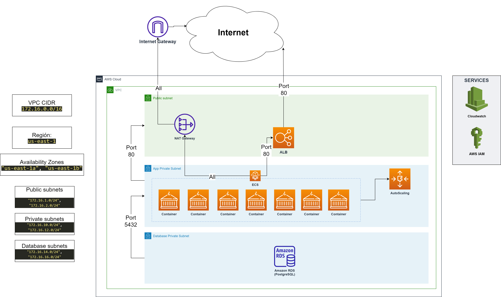

# Terraform Demo

An infrastructure is implemented in Terraform, with two availability zones, a container cluster is deployed in AWS ECS that allows the deployment of a .NET Core-based container that accesses a PostgreSQL database in the AWS RDS service. There are scaling rules, which allow scaling with 65% CPU or RAM usage, up to a maximum of 8 instances.



## Usage

Create a terraform.tfstate file that will contain the AWS account access secrets, you can use the following content:
```
aws_access_key = ""
aws_secret_key = ""
```

Initialize Terraform, allows you to download the necessary modules:
```
terraform init
```

To generate the deployment plan with terraform, you can use the following command:
```
terraform plan -out tf.out
```

Applying the deployment plan with terraform, you will have to wait a few minutes until the infrastructure is available:
```
terraform apply tf.out 
```

Destroy the infrastructure (at the end of the exercise):
```
terraform destroy
```

## Requirements

| Name | Version |
|------|---------|
| terraform | >= 1.2.8 |

## Providers

| Name | Version |
|------|---------|
| aws | 4.0.0 |

## Inputs

| Name | Description |
|------|-------------|
| aws\_region | AWS Region for the deployment |
| aws\_access\_key | AWS Access Key |
| aws\_secret\_key | AWS Secret Key |
| vpc\_name | VPC Name |
| vpc\_cidr | VPC CIDR Block |
| availability\_zones | Availability Zones |
| vpc\_private\_subnets | List of Private Subnets |
| vpc\_public\_subnets | List of Public Subnets |
| vpc\_db\_subnets | List of Database Subnets |
| task\_name | Task Name for ECS |
| vpc\_tags | A map of tags to add to all resources. |
| rds\_identifier | RDS Instance Name |
| rds\_instance\_type | RDS Instance Type. Example: db.t3.micro |
| rds\_storage\_size | RDS Storage Size in GB |
| rds\_engine | RDS Engine. Example: postgres |
| rds\_db\_name | Database Name |
| rds\_admin\_user | RDS Administrator username |
| rds\_admin\_password | RDS Administrator password |

## Outputs

| Name | Description |
|------|-------------|
| alb\_url | Application Load Balancer URL (You can enter from the web browser) |
| postgress-address | AWS RDS Endpoint |

## Load Test

If you have Apache Benchmark installed, you can use the following command (Replace <alb_url> with the address from the previous section)
```
ab -k -n100000 -c1000 -H 'Accept-Encoding: gzip,deflate' <alb_url>
```

Example:
```
ab -k -n100000 -c1000 -H 'Accept-Encoding: gzip,deflate' http://nginx-service-lb-1557797790.us-east-1.elb.amazonaws.com/employees
```